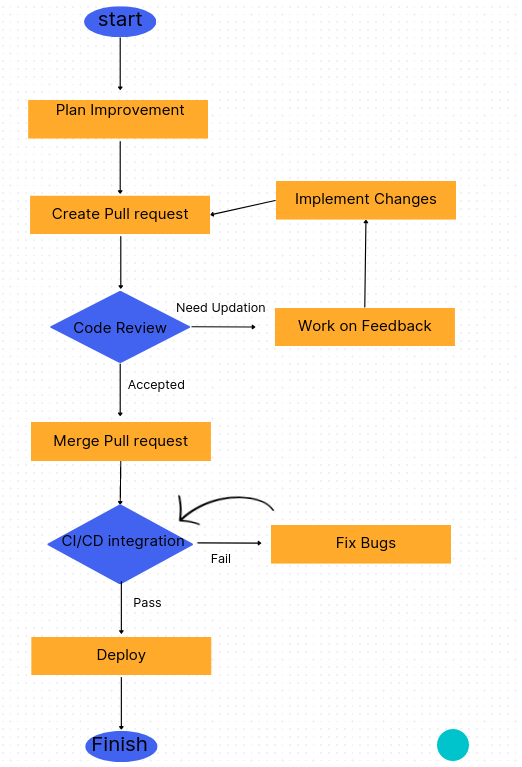

# Scenario:

You're assigned to a project that involves implementing a critical feature using a branching strategy inspired by GitFlow. Each developer creates feature branches, works on their assigned tasks, and then submits pull-requests for code review.

# Problem Statement:
You've been assigned to a project that involves enhancing a critical feature for a web application. The team places a strong emphasis on the pull-request workflow, with a focus on code reviews, merge conflict resolution, and the recent integration of CI/CD. As you navigate through the development task, you encounter challenges such as feedback during code reviews and discussions on effective merge conflict resolution. The team looks to you to demonstrate your understanding of these challenges and your ability to adapt to the added complexity of CI/CD integration.


# Handling Code review feedback

## Description of the problem:
In the current code the filtering of matches contains a bug that causes the filtering to not work as expected. The bug is that the state of the filter is not updating with the change in selected option.


---
### Initial code:
```cpp

//imports

export default function LiveMatchList() {
  //logic to fetch data and update state
  console.log(selectedCategory);
    const handleCategoryChange = (category: any) => {
      console.log(category);
    setSelectedCategory(category);
    console.log(selectedCategory);
  };
  return (
    <div className="container mx-auto">
      <div className="flex justify-end w-11/12 mx-auto my-2">
        <select
          className="justify-between  px-5 text-orange-600 bg-grey-400 rounded-lg"
        >
          {categories.map((category) => (
            <option
              key={category}
              onClick={() => handleCategoryChange(category)}
              className={
                category === selectedCategory
                  ? "active bg-slate-500 hover:bg-gray-400 dark:bg-blue-500 p-2 rounded-md hover:bg-blue-400"
                  : "p-2 rounded-md bg-slate-300 hover:bg-gray-400 dark:hover:bg-blue-400 bg-slate-800"
              }
            >
              {category}
            </option>
          ))}
        </select>
        <div className="bg-gray-300 rounded-lg mx-2 p-3 text-black-600">
          <FunnelIcon className="h-4 w-4" />
        </div>

        {/*List matches*/}

      </div>
    </div>
  );
}
  
```

### Code review feedback:

```cpp

//{imports}

export default function LiveMatchList() {
  //{logic to fetch data and update state}

  // remove unnecessary console.log to avoid cluttering the console
  // froperly format the code to make it more readable and easier to understand
  console.log(selectedCategory);
    const handleCategoryChange = (category: any) => {
      console.log(category);
    setSelectedCategory(category);
    console.log(selectedCategory);
  };
  return (
    <div className="container mx-auto">
      <div className="flex justify-end w-11/12 mx-auto my-2">
        {/*set value attribute to selectedCategory and add onChange event to handle the change*/}
        <select
          className="justify-between  px-5 text-orange-600 bg-grey-400 rounded-lg"
        >
          {categories.map((category) => (
            <option
              key={category}
              onClick={() => handleCategoryChange(category)}
              className={
                category === selectedCategory
                  ? "active bg-slate-500 hover:bg-gray-400 dark:bg-blue-500 p-2 rounded-md hover:bg-blue-400"
                  : "p-2 rounded-md bg-slate-300 hover:bg-gray-400 dark:hover:bg-blue-400 bg-slate-800"
              }
            >
              {category}
            </option>
          ))}
        </select>
        <div className="bg-gray-300 rounded-lg mx-2 p-3 text-black-600">
          <FunnelIcon className="h-4 w-4" />
        </div>

        {/*List matches*/}

      </div>
    </div>
  );
}
  
```

### Updated code after feedback:
```cpp

//{imports}

export default function LiveMatchList() {
  //{logic to fetch data and update state}

  const handleCategoryChange = (category: any) => {
    setSelectedCategory(category);
  };

  return (
    <div className="container mx-auto">
      <div className="flex justify-end w-11/12 mx-auto my-2">
        <select
          value={selectedCategory}
          onChange={(e) => handleCategoryChange(e.target.value)}
          className="justify-between  px-5 text-orange-600 bg-grey-400 rounded-lg"
        >
          {categories.map((category) => (
            <option
              key={category}
              onClick={() => handleCategoryChange(category)}
              className={
                category === selectedCategory
                  ? "active bg-slate-500 hover:bg-gray-400 dark:bg-blue-500 p-2 rounded-md hover:bg-blue-400"
                  : "p-2 rounded-md bg-slate-300 hover:bg-gray-400 dark:hover:bg-blue-400 bg-slate-800"
              }
            >
              {category}
            </option>
          ))}
        </select>
        <div className="bg-gray-300 rounded-lg mx-2 p-3 text-black-600">
          <FunnelIcon className="h-4 w-4" />
        </div>

        {/*List matches*/}

      </div>
    </div>
  );
}
  
```

---
# Iterative Development Process:

- The developer writes the initial code and submits a pull request for review.
- The reviewer provides feedback on the code and suggests improvements.
- The developer updates the code based on the feedback and submits a new pull request.
- Then the updated code is reviewed again and the process continues until the code is approved.
- The code is merged into the main branch and deployed using CI/CD.
- The developer monitors the deployed code and handles any issues that arise.
- Once the code is stable, the changes are released to production.

---
# Resolving Merge Conflicts:

## Initial code:
```cpp

//{imports}

export default function LiveMatchList() {
  //{logic to fetch data and update state}

  const handleCategoryChange = (category: any) => {
    setSelectedCategory(category);
  };

  return (
    <div className="container mx-auto">
      <div className="flex justify-end w-11/12 mx-auto my-2">
        <select
          value={selectedCategory}
          onChange={(e) => handleCategoryChange(e.target.value)}
          className="justify-between  px-5 text-orange-600 bg-grey-400 rounded-lg"
        >
          {categories.map((category) => (
            <option
              key={category}
              onClick={() => handleCategoryChange(category)}
              className={
                category === selectedCategory
                  ? "active bg-slate-500 hover:bg-gray-400 dark:bg-blue-500 p-2 rounded-md hover:bg-blue-400"
                  : "p-2 rounded-md bg-slate-300 hover:bg-gray-400 dark:hover:bg-blue-400 bg-slate-800"
              }
            >
              {category}
            </option>
          ))}
        </select>
        <div className="bg-gray-300 rounded-lg mx-2 p-3 text-black-600">
          <FunnelIcon className="h-4 w-4" />
        </div>

        {/*List matches*/}

      </div>
    </div>
  );
}
  
```

## Consider A's changes:
```cpp

//{imports}

export default function LiveMatchList() {
  //{logic to fetch data and update state}

  const handleCategoryChange = (category: any) => {
    setSelectedCategory(category);
  };

  const handleSortChange = (sort: any) => {
    setSortBy(sort);
  };

  return (
    {/*rest of the code*/}
  );
}
  
```

## Consider B's changes:
```cpp

//{imports}

export default function LiveMatchList() {
  //{logic to fetch data and update state}

  const handleCategoryChange = (category: any) => {
    setSelectedCategory(category);
  };

  const handleFilterChange = (filter: any) => {
    setFilterBy(filter);
  };

  return (
    {/*rest of the code*/}
  );
}
  
```

## Merge Conflict:
```cpp

//{imports}

export default function LiveMatchList() {
  //{logic to fetch data and update state}

  const handleCategoryChange = (category: any) => {
    setSelectedCategory(category);
  };

  <<<<<<< HEAD
  const handleSortChange = (sort: any) => {
    setSortBy(sort);
  };
  =======
  const handleFilterChange = (filter: any) => {
    setFilterBy(filter);
  };
  >>>>>>> feature/filtering

  return (
    {/*rest of the code*/}
  );
}
  
```
### The merge conflict occured because both A and B made changes to the same function. The developer needs to resolve the conflict by deciding which changes to keep and which to discard.

## Resolving Merge Conflict:
- ### **Fetch the latest changes from the remote repository and merge them into the current branch.**
  ```
    - git fetch origin
    - git merge origin/main
  ```

  #### But we see a conflict message:

  ``` 
    CONFLICT (content): Merge conflict in LiveMatchList.tsx Automatic merge failed; fix conflicts and then commit the result. 
  ```
- ### **The developer needs to manually resolve the conflict by editing the file and deciding which changes to keep.**
  ```cpp
    //imports

    export default function LiveMatchList() {
      //{logic to fetch data and update state}

      const handleCategoryChange = (category: any) => {
        setSelectedCategory(category);
      };

      const handleSortChange = (sort: any) => {
        setSortBy(sort);
      };

      const handleFilterChange = (filter: any) => {
        setFilterBy(filter);
      };

      return (
        {/*rest of the code*/}
      )
  ```
- ```
    - git add LiveMatchList.tsx
    - git commit -m "Resolved merge conflict"
    - git push origin feature/filtering
  ```
- ### **Review the changes and ensure that the conflict has been resolved correctly.**
  - Ensure that both A and B's changes are included in the final code.
  - Run the application and test the functionality to verify that the changes are working as expected.
  - Once the conflict has been resolved, the code can be merged into the main branch and deployed using CI/CD.

---

# CI/CD Integration:

 ### Integrating Continuous Integration/Continuous Deployment (CI/CD) into a project involves setting up automated testing, code quality checks, and deployment pipelines to ensure code quality and streamline the deployment process.

 ### MatchList.tsx
```cpp
//{imports}

export default function LiveMatchList() {
  //{logic to fetch data and update state}

  const handleCategoryChange = (category: any) => {
    setSelectedCategory(category);
  };

  const handleSortChange = (sort: any) => {
    setSortCategory(sort);
  };

  return (
    <div className="container mx-auto">
      <div className="flex justify-end w-11/12 mx-auto my-2">
        <select
          value={selectedCategory}
          onChange={(e) => handleCategoryChange(e.target.value)}
          className="justify-between  px-5 text-orange-600 bg-grey-400 rounded-lg"
        >
          {categories.map((category) => (
            <option
              key={category}
              onClick={() => handleCategoryChange(category)}
              className={
                category === selectedCategory
                  ? "active bg-slate-500 hover:bg-gray-400 dark:bg-blue-500 p-2 rounded-md hover:bg-blue-400"
                  : "p-2 rounded-md bg-slate-300 hover:bg-gray-400 dark:hover:bg-blue-400 bg-slate-800"
              }
            >
              {category}
            </option>
          ))}
        </select>
        <div className="bg-gray-300 rounded-lg mx-2 p-3 text-black-600">
          <FunnelIcon className="h-4 w-4" />
        </div>

        <select
          value={SortCategory}
          onChange={(e) => handleSortChange(e.target.value)}
          className="justify-between  px-5 text-orange-600 bg-grey-400 rounded-lg"
        >
          {sortCategories.map((sort) => (
            <option
              key={sort}
              onClick={() => handleSortChange(sort)}
              className={
                sort === SortCategory
                  ? "active bg-slate-500 hover:bg-gray-400 dark:bg-blue-500 p-2 rounded-md hover:bg-blue-400"
                  : "p-2 rounded-md bg-slate-300 hover:bg-gray-400 dark:hover:bg-blue-400 bg-slate-800"
              }
            >
              {sort}
            </option>
          ))}
        </select>

        {/*Rest of the code*/}

      </div>
    </div>
  );
}
  
```

## MatchList.test.tsx
```cpp
import React from 'react';
import { render, fireEvent } from '@testing-library/react';
import LiveMatchList from '../src/LiveMatchList';

test('renders LiveMatchList component', () => {
  const { getByText } = render(<LiveMatchList />);
  const linkElement = getByText(/LiveMatchList/i);
  expect(linkElement).toBeInTheDocument();
});

test('select category', () => {
  const { getByText } = render(<LiveMatchList />);
  const category = getByText('Category 1');
  fireEvent.click(category);
  expect(category).toHaveClass('active');
});

test('select sort category', () => {
  const { getByText } = render(<LiveMatchList />);
  const sortCategory = getByText('SortBy: Title');
  fireEvent.click(sortCategory);
  expect(sortCategory).toHaveClass('active');
});
```

## Automated Tests and Quality Checks can be performed by:
```bash
  - npm run lint
  - npm test
  - npm run build
```
## Potential Issues:
- ### **Linting Errors:**
  These can be solved by reviewing the errors provided by ESLint and fix the issues in the code. Some of the common fixes include following coding conventions, fixing indentation issues, and removing unused variables, etc.

- ### **Test Failures:**
  To fix this issue we have to review the test output to identify which tests failed and why. Then debug the code to fix the issues, then re-run the tests.

- ### **Build Failures:**
  To fix this issue we have to review the build output to identify the errors and fix them. Most common issues include missing dependencies, syntax errors, and configuration issues, etc.