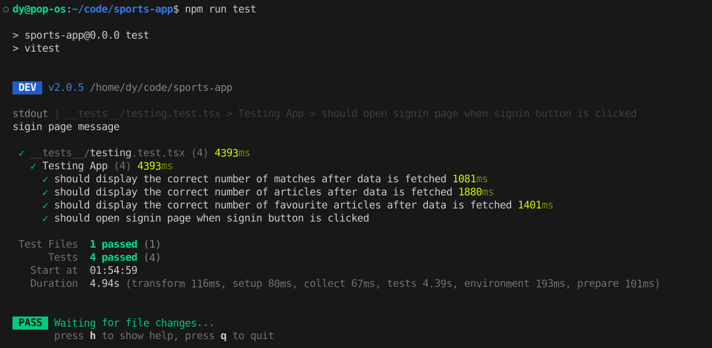
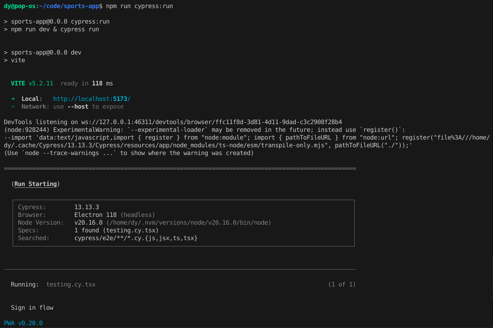
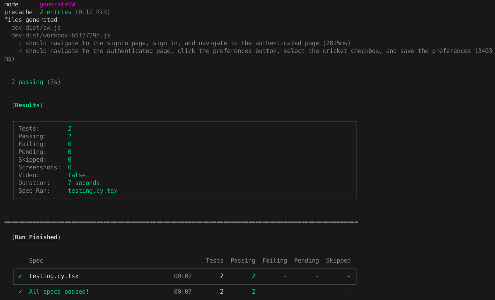
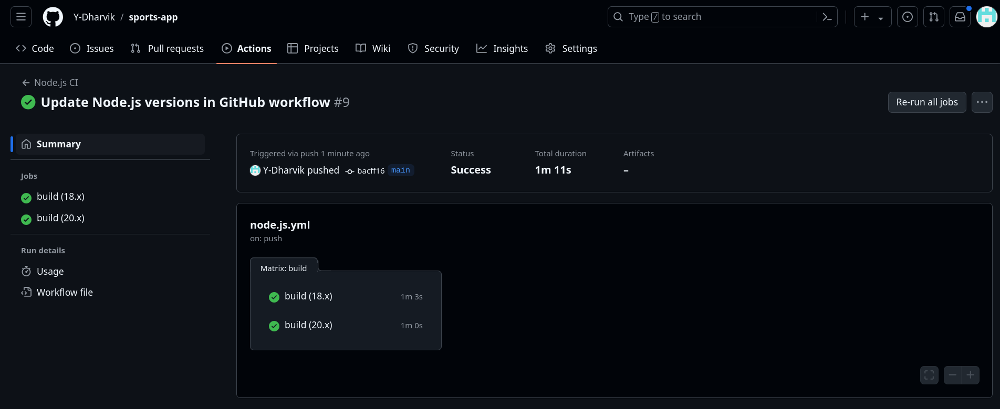

## Configuration of Testing Framework:
The sports app uses Vitest for unit testing and Cypress for integration testing. These tools are configured to ensure thorough testing of the app's features, including user interactions and API integrations.

### Vitest Configuration (Unit Testing):
Vitest is a lightweight testing framework that is used to test the app's components. The configuration of Vitest is as follows:

1. **Installation**: Vitest is installed as a dev dependency using the following command:
   ```
   npm install --save-dev vitest
   ```
2. **Configuration**: The Vitest configuration file is located at `./vitest.config.js`. This file specifies the test environment and the test files to be executed.

3. **Running Tests**: The tests can be run using the following command:
   ```
   npm run test
   ```

In the package.json, the following scripts handle Vitest execution:
```json
"scripts": {
    "dev": "vite",
    "build": "tsc && vite build",
    "lint": "eslint . --ext ts,tsx --report-unused-disable-directives --max-warnings 0",
    "preview": "vite preview",
    "coverage": "vitest run --coverage",
    "test": "vitest",
    "test:ui": "vitest --ui"
}
```

### Cypress Configuration (Integration Testing):
Cypress is used for integration testing of the app's features. The configuration of Cypress is as follows:

1. **Installation**: Cypress is installed as a dev dependency using the following command:
   ```
   npm install --save-dev cypress
   ```
2. **Configuration**: The Cypress configuration file is located at `./cypress.json`. This file specifies the test environment and the test files to be executed.

3. **Running Tests**: The tests can be run using the following command:
   ```
   npm run test:ui
   ```

The `package.json` includes Cypress commands for both opening the test runner and running tests headlessly:
```json
"scripts": {
    "cypress:open": "cypress open",
    "cypress:run": "npm run dev & cypress run"
}
```


## Test Suite and Code Coverage:
The application is covered by:

- Unit Tests (via Vitest): These cover individual functions and components such as API calls and component rendering.
- Integration Tests (via Cypress): These simulate real user interactions to ensure the application works as intended when different features interact.

Code Coverage Reporting is enabled for Vitest tests. The coverage report can be generated using the following command:
```
npm run coverage
```
- Coverage Reports: These provide metrics such as lines covered, branches covered, and functions covered. Cypress tests are used for high-level integration coverage, ensuring the app behaves correctly in different scenarios.

### Unit tests:

Example Vitest Unit Test:
```typescript
import { expect, describe, it, beforeEach } from 'vitest'
import { render, screen, waitFor, fireEvent } from '@testing-library/react'
import App from '../src/App'

describe('Testing App', () => {
  beforeEach(() => {
    render(<App />);
  });

  it('should display the correct number of matches after data is fetched', async () => {
    // Wait for the matches to be rendered and then check the count
    await waitFor(async() => {
      const matches = await screen.findAllByTestId('match-item'); // each match has a `data-testid="match-item"`
      expect(matches.length).toBeGreaterThan(1);
    }, {timeout: 10000});
  });

  it('should display the correct number of articles after data is fetched', async () => {
    // Wait for the articles to be rendered and then check the count
    await waitFor(async() => {
      const articles = await screen.findAllByTestId('article-item'); // each article has a `data-testid="article-item"`
      expect(articles.length).toBeGreaterThan(1);
    }, {timeout: 10000});
  });

  it('should display the correct number of favourite articles after data is fetched', async () => {
    await waitFor(() => {
      const element = screen.queryByTestId('no-favart-item');
      expect(element).toBeInTheDocument();
    }, {timeout: 10000});
  });

  it('should open signin page when signin button is clicked', async () => {
    const signinButton = screen.getByTestId('signin-button');
    fireEvent.click(signinButton);
    await waitFor(() => {
      const signinPage = screen.getByTestId('signin-page');
      expect(signinPage).toBeInTheDocument();
    }, {timeout: 10000});
  }, {timeout: 10000});
});
```
- Output:

    [](Unit-out.png)

### Integration tests:

Example Cypress Integration Test:
```typescript
describe('Sign in flow', () => {
    it('should navigate to the signin page, sign in, and navigate to the authenticated page', () => {
      // Visit the landing page
      cy.visit('http://localhost:5173/view');
  
      // Click the Sign in button
      cy.get('[data-testid="signin-button"]').click();
  
      // Verify that the signin page opens
      cy.url().should('include', '/signin');
  
      // Fill in the login information
      cy.get('input[id="email"]').type('dy69@gmail.com');
      cy.get('input[id="password"]').type('1234');
  
      // Submit the signin form
      cy.get('button[type="submit"]').click();
  
      // Verify that the new page with data-testid="auth-page" opens
      cy.get('[data-testid="auth-page"]').should('be.visible');
    });


    it('should navigate to the authenticated page, click the preferences button, select the cricket checkbox, and save the preferences', () => {
      // Visit the landing page
      cy.visit('http://localhost:5173/view');
  
      // Click the Sign in button
      cy.get('[data-testid="signin-button"]').click();
  
      // Verify that the signin page opens
      cy.url().should('include', '/signin');
  
      // Fill in the login information
      cy.get('input[id="email"]').type('dy69@gmail.com');
      cy.get('input[id="password"]').type('1234');
  
      // Submit the signin form
      cy.get('button[type="submit"]').click();
  
      // Verify that the new page with data-testid="auth-page" opens
      cy.get('[data-testid="auth-page"]').should('be.visible');
  
      // Click the Preferences button
      cy.get('[data-testid="Preferences-button"]').click();
  
      // Verify that the preferences modal opens
      cy.get('[data-testid="preferences-modal"]').should('be.visible');
  
      // Select the cricket checkbox
      cy.get('input[id="Rugby"]').check();
  
      // Save the preferences
      cy.get('button[type="submit"]').click();
  
      // Verify that the sport is visible in the favorites list
      cy.get('[data-testid="fav-sport-categories"]').should('contain', 'Rugby');

    });
  });
```

- Output:

    [](Int-out.png)
    [](Int-out2.png)

## Automatic Test Suite Execution on GitHub:
To automate testing, GitHub Actions are configured to run the test suite every time code is pushed or a pull request is created.

Example GitHub Actions:
    
```yaml
# This workflow will do a clean installation of node dependencies, cache/restore them, build the source code and run tests across different versions of node
# For more information see: https://docs.github.com/en/actions/automating-builds-and-tests/building-and-testing-nodejs

name: Node.js CI

on:
  push:
    branches: [ "main" ]
  pull_request:
    branches: [ "main" ]

jobs:
  build:

    runs-on: ubuntu-latest

    strategy:
      matrix:
        node-version: [18.x, 20.x]
        # See supported Node.js release schedule at https://nodejs.org/en/about/releases/

    steps:
    - uses: actions/checkout@v4
    - name: Use Node.js ${{ matrix.node-version }}
      uses: actions/setup-node@v4
      with:
        node-version: ${{ matrix.node-version }}
        cache: 'npm'
    - run: npm ci
    - run: npm run build --if-present
    - run: npm test
    - run: npm run cypress:run
```
The implemented GitHub Actions workflow ensures continuous integration (CI) by automatically running the test suite on GitHub.

Key Features:

- Automated Testing: Every push or pull request triggers both unit and integration tests, ensuring no untested code is merged.
- Cross-Platform Testing: The tests run on an Ubuntu runner, simulating a clean environment for testing the app.
- Feedback Loop: Test results are automatically provided in the pull request, alerting developers of any issues before merging.

Actions Output:

[](Actions.png)