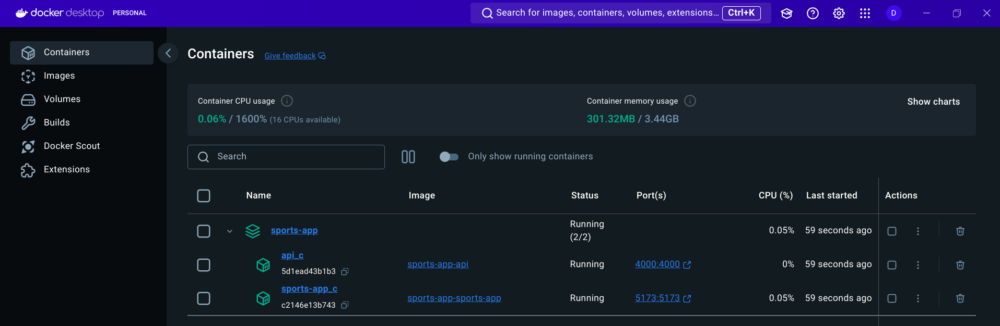
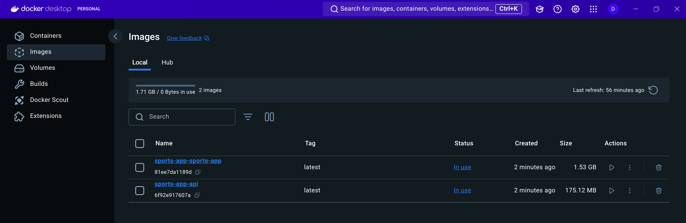

# Automating Node.js Application Deployment with Docker and CI/CD Pipelines

## Introduction:
The application contains an api service and the sports app. The api service is an express server that return custom atricles. We dockerize the application and deploy it using CI/CD pipelines.

## Dockerizing the Application:
First of all, we need to create a `dockerfile` in the root directory of the api server. The Dockerfile should contain the following code:

`Dockefile`:
```Dockerfile
FROM node:17-alpine

RUN npm install -g nodemon

WORKDIR /app

COPY . .

RUN npm install

EXPOSE 4000

CMD [ "npm", "run", "dev" ]

```
Then we create the `dockerfile` for the sports app. The Dockerfile should contain the following code:

`Dockerfile`:
```Dockerfile
FROM node:20.17-alpine

WORKDIR /app

COPY . .

RUN npm install


EXPOSE 5173

CMD ["npm", "run", "dev"]
```
Then we create a `docker-compose.yml` file in the root directory of the project. The `docker-compose.yml` file should contain the following code:

`docker-compose.yml`:
```yml
version: "3.8"
services:
  api:
    build: ./api
    container_name: api_c
    ports:
      - "4000:4000"
    volumes:
      - ./api:/app
      - /app/node_modules
    environment:
      - NODE_ENV=development
    command: npm run dev

  sports-app:
    build: ./sports-app
    container_name: sports-app_c
    ports:
      - "5173:5173"
    volumes:
      - ./sports-app:/app
      - /app/node_modules
    environment:
      - NODE_ENV=development
    command: npm run dev
    stdin_open: true
    tty: true
```
The `docker-compose.yml` file contains two services: `api` and `sports-app`. The `api` service is the express server that returns custom articles. The `sports-app` service is the sports app. The `api` service is exposed on port `4000` and the `sports-app` service is exposed on port `5173`.


- `version`: The version of the docker-compose file.
- `services`: The services that are defined in the docker-compose file.
- `api`: The api service.
  - `build`: The path to the Dockerfile for the api service.
  - `container_name`: The name of the container for the api service.
  - `ports`: The ports that are exposed by the api service.
  - `volumes`: The volumes that are mounted by the api service.
  - `environment`: The environment variables that are set for the api service.
  - `command`: The command that is run by the api service.
- `sports-app`: The sports app service.
    - `build`: The path to the Dockerfile for the sports app service.
    - `container_name`: The name of the container for the sports app service.
    - `ports`: The ports that are exposed by the sports app service.
    - `volumes`: The volumes that are mounted by the sports app service.
    - `environment`: The environment variables that are set for the sports app service.
    - `command`: The command that is run by the sports app service.
    - `stdin_open`: The stdin_open flag for the sports app service.
    - `tty`: The tty flag for the sports app service.

## Running the docker-compose file:
- To run the docker-compose file, we need to run the following command in the root directory of the project:
```bash
docker compose up
```
This command will start the two services defined in the `docker-compose.yml` file.

[](containers.png)
[](images.png)

- To stop the services, we need to run the following command in the root directory of the project:
```bash
docker compose down
```
This command will stop the services defined in the `docker-compose.yml` file.

## CI/CD Pipelines:
We use GitHub Actions to create CI/CD pipelines for the application. The CI/CD pipelines are defined in the `.github/workflows` directory. The CI/CD pipelines are triggered on push to the `main` branch.

This is the structure of the `node.js.yml` file in the `.github/workflows` directory:
```yml
# This workflow will do a clean installation of node dependencies, cache/restore them, build the source code and run tests across different versions of node
# For more information see: https://docs.github.com/en/actions/automating-builds-and-tests/building-and-testing-nodejs

name: Node.js CI

on:
  push:
    branches: [ "main" ]
  pull_request:
    branches: [ "main" ]

jobs:
  build:

    runs-on: ubuntu-latest

    strategy:
      matrix:
        node-version: [18.x, 20.x]
        # See supported Node.js release schedule at https://nodejs.org/en/about/releases/

    steps:
    - uses: actions/checkout@v4
    - name: Use Node.js ${{ matrix.node-version }}
      uses: actions/setup-node@v4
      with:
        node-version: ${{ matrix.node-version }}
        cache: 'npm'
    - run: npm ci
    - run: npm run build --if-present
    - run: npm test
    - run: npm run cypress:run

```

The CI pipeline runs the following steps:
- `checkout`: Checks out the code from the repository.
- `setup-node`: Sets up the Node.js environment.
- `npm ci`: Installs the dependencies using `npm ci`.
- `npm run build --if-present`: Builds the source code if a build script is present in the `package.json` file.
- `npm test`: Runs the Unit tests.
- `npm run cypress:run`: Runs the Cypress integration tests.

Whenever we push to the `main` branch, the CI pipeline is triggered and the steps are executed. This ensures that the code is tested and built before it is deployed.

## Video Demo:

[](https://drive.google.com/drive/folders/1PjYp_0fjTXokUfR5lF9142DPQQwWQz38?usp=drive_link)


