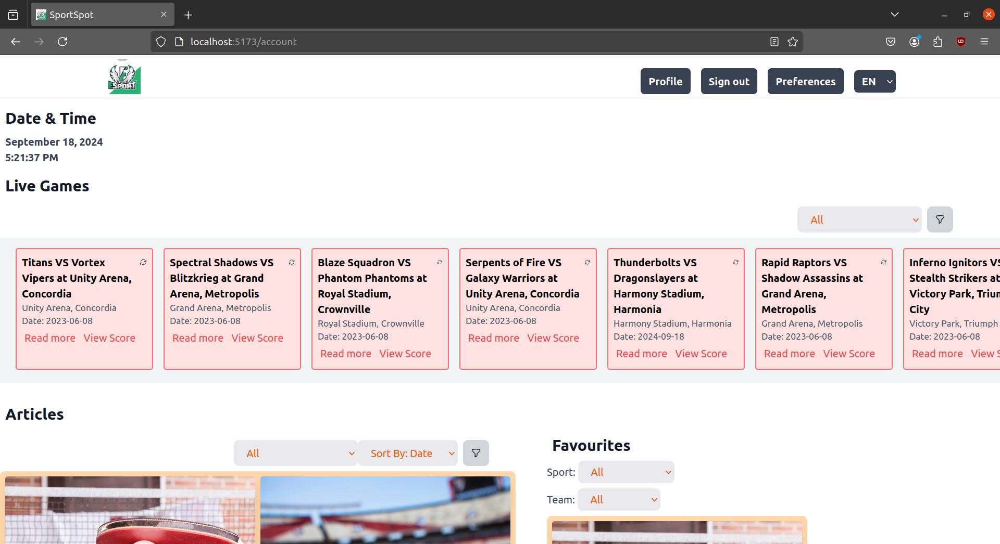
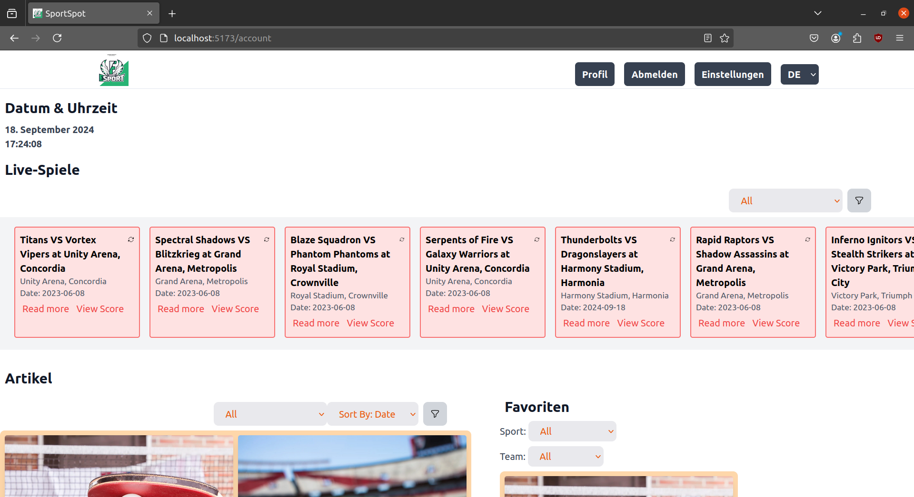

# Implement i18n and l10n features in your React.js application

## Set up a collaborative translation tool:
Collaborative translation tools are essential for managing the translation process. They allow you to easily manage the translation process, track the progress of translations, and ensure that all translations are accurate and consistent. Some popular collaborative translation tools include: Traduora, Crowdin, and Lokalise, etc.

We can use Traduora as an example to demonstrate how to set up a collaborative translation tool. Traduora is an open-source translation management system that allows you to manage translations for your projects. We can generate the translation files in the JSON format and import them into Traduora. After the translations are completed, we can export the translated files and use them in our React.js application.

## Adding translation for each language:
To add translations for each language, we need to create a JSON file for each language. The JSON file should contain key-value pairs for each translation. For example, we can create a JSON file for English translations and another JSON file for German translations.

English taranslation file:
```json
{
    "translation":{
        "Articles": "Articles",
        "Live Games": "Live Games",
        "Favorites": "Favorites",
        "Profile": "Profile",
        "Preferences": "Preferences",
        "Sign up": "Sign out",
        "Sign in": "Sign in",
        "Sign out": "Sign out",
        "Date & Time": "Date & Time"
    }
}


```

German translation file:
```json
{
    "translation":{
        "Articles": "Artikel",
        "Live Games": "Live-Spiele",
        "Favorites": "Favoriten",
        "Profile": "Profil",
        "Preferences": "Einstellungen",
        "Sign up": "Anmelden",
        "Sign in": "Anmelden",
        "Sign out": "Abmelden",
        "Date & Time": "Datum & Uhrzeit"
    }
}
```

## Setting up your React project to make use of i18n:

### Install the Dependencies:
To set up i18n in your React.js application, you need to install the following dependencies:

```bash
npm install i18next react-i18next i18next-browser-languagedetector
```

### Initialize i18n:
To initialize i18n in your React.js application, you need to create an i18n configuration file. The configuration file should contain the following code:

i18n.ts:
```typescript
import i18n from "i18next";
import LanguageDetector from "i18next-browser-languagedetector";
import { initReactI18next } from "react-i18next";
import enJson from "./locale/en.json";
import deJson from "./locale/de.json";

i18n
  .use(LanguageDetector)
  .use(initReactI18next)
  .init({
    resources: {
      en: { ...enJson },
      de: { ...deJson },
    },
    fallbackLng: "en",
    debug: true,
  });

```

### Wrap your App component with the i18n provider:
To make use of i18n in your React.js application, you need to wrap your App component with the i18n provider. The i18n provider will provide the i18n instance to all the components in your application.

main.tsx:
```typescript
// import React from 'react'
import ReactDOM from 'react-dom/client'
import App from './App.tsx'
import './index.css'
import { ThemeProvider } from "./context/theme.tsx";
import './i18n.ts'

const rootElement = document.getElementById('root');
if (rootElement) {
  ReactDOM.createRoot(rootElement).render(
    <ThemeProvider>
      <App />
    </ThemeProvider>,
  )
}
```

### Dynamically load translations:
To dynamically load translations in your React.js application, you can use the useTranslation hook provided by the react-i18next library. The useTranslation hook allows you to access the translations for the current language in your components.

Example:
```typescript
import React from 'react'
import { useTranslation } from 'react-i18next'

const MyComponent = () => {
    const {t, i18n} = useTranslation();
    const [currLang, setCurrLang] = useState(() => i18n.language);
    useEffect(() => {
        i18n.changeLanguage(currLang);
    }, [currLang]);
    const auth = !!localStorage.getItem("authToken");
    const data = JSON.parse(localStorage.getItem("userData") || "{}");
    let navigation = [];
    if(auth){
        navigation = [
            { name: t("Profile"), href: "/account/profile", current: false },
            { name: t("Sign out"), href: "/logout", current: false },
            { name : t("Preferences"), href: "/account/preferences", current: false}
        ];
    }

    return(
        <>
            <div>
                <select
                    className="px-3 py-2 bg-gray-700 hover:bg-gray-800 text-white font-semibold rounded-md focus:outline-none focus:shadow-outline-gray mt-4"
                    onChange={(e) => setCurrLang(e.target.value)}
                    value={currLang}
                >
                    <option value="en">EN</option>
                    <option value="de">DE</option>
                </select>
            </div>
        </>
    )
}
```
- Here the `useTranslation` hook is used to access the translations for the current language. The `t` function is used to translate the keys to the corresponding values in the current language. The `i18n` object is used to change the current language dynamically. The `useState` and `useEffect` hooks are used to manage the current language state and update the language when the user selects a different language from the dropdown.

## Localizing Date and Time:

By using the `Intl.DateTimeFormat` API, we can localize the date and time in our React.js application. The `Intl.DateTimeFormat` API provides a way to format dates and times according to the user's locale. We can create a custom date and time component that displays the current date and time in the user's preferred format and language.

dateTime Component:
```typescript
import { useEffect } from "react";
import { useState } from "react";
import { useTranslation } from "react-i18next";

const DateTimeLocal = () => {
    const { i18n } = useTranslation();
    const dFormatter = new Intl.DateTimeFormat(i18n.language, {
        year: "numeric",
        month: "long",
        day: "numeric",
    });
        
    const tFormatter = new Intl.DateTimeFormat(i18n.language, {
        hour: "numeric",
        minute: "numeric",
        second: "numeric",
    });
    const [currTime, setCurrTime] = useState(tFormatter.format(new Date()));
    useEffect(() => {
        const interval = setInterval(() => {
            setCurrTime(tFormatter.format(new Date()));
        }, 1000);
        return () => clearInterval(interval);
    }, [currTime, i18n.language]);

  return (
    <div className="flex flex-col">
      <div className="font-bold text-gray-700 px-2">
        {dFormatter.format(new Date())}
      </div>
      <div className="font-semibold text-gray-700 px-2">
        {currTime}
      </div>
    </div>
  );
};

export default DateTimeLocal;
```

### Working:
#### English Locale:
[](eng.png)

    - The Date & Time and the other items are shown in the selected English locale.


#### German Locale:

[](ger.png)
    
        - The Date & Time and the other items are shown in the selected German locale.


### Video Demo:
[](https://drive.google.com/file/d/1WL0Mgds09C4jFhpTcPFTLxnaWZ43BDMl/view?usp=sharing)

