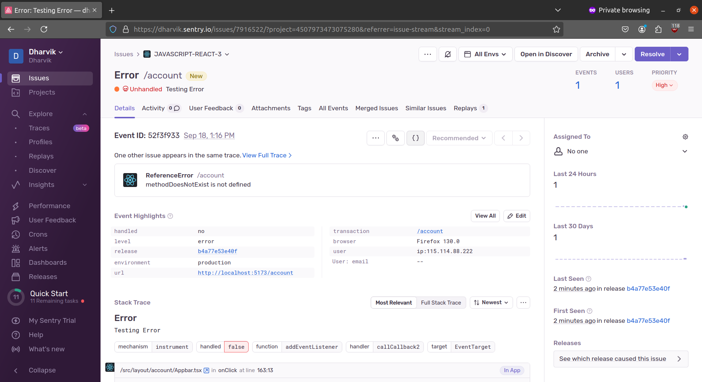

# Adding Error Tracking to a React Project

## Configure React SDK:

### Install Sentry:
    
```bash
npm install --save @sentry/react
```

### Configure Sentry SDK:

```javascript
//...
import * as Sentry from "@sentry/react";

Sentry.init({
  dsn: "https://0f38fff0d22ee43a9ac02e1c4f24a7ec@o4507973469929472.ingest.de.sentry.io/4507973473075280",
  integrations: [
    Sentry.browserTracingIntegration(),
    Sentry.replayIntegration(),
  ],
  // Tracing
  tracesSampleRate: 1.0, //  Capture 100% of the transactions
  // Set 'tracePropagationTargets' to control for which URLs distributed tracing should be enabled
  tracePropagationTargets: ["localhost", /^https:\/\/yourserver\.io\/api/],
  // Session Replay
  replaysSessionSampleRate: 0.1, // This sets the sample rate at 10%. You may want to change it to 100% while in development and then sample at a lower rate in production.
  replaysOnErrorSampleRate: 1.0, // If you're not already sampling the entire session, change the sample rate to 100% when sampling sessions where errors occur.
});

const container = document.getElementById(“app”);
const root = createRoot(container);
root.render(<App />);
```

### Upload Source Maps:
We need to upload the source maps to Sentry so that it can deobfuscate the stack traces. To do this, we need to install the `@sentry/wizard` package:

```bash
npx @sentry/wizard@latest -i sourcemaps
```

Logs:
```bash
npx @sentry/wizard@latest -i sourcemaps
Need to install the following packages:
@sentry/wizard@3.29.0
Ok to proceed? (y) y

npm warn deprecated inflight@1.0.6: This module is not supported, and leaks memory. Do not use it. Check out lru-cache if you want a good and tested 
way to coalesce async requests by a key value, which is much more comprehensive and powerful.                                                        npm warn deprecated glob@8.1.0: Glob versions prior to v9 are no longer supported

┌   Sentry Source Maps Upload Configuration Wizard 
│
◇   ──────────────────────────────────────────────────────────────────────────────────╮
│                                                                                     │
│  This wizard will help you upload source maps to Sentry as part of your build.      │
│  Thank you for using Sentry :)                                                      │
│                                                                                     │
│  (This setup wizard sends telemetry data and crash reports to Sentry.               │
│  You can turn this off by running the wizard with the '--disable-telemetry' flag.)  │
│                                                                                     │
│  Version: 3.29.0                                                                    │
│                                                                                     │
├─────────────────────────────────────────────────────────────────────────────────────╯
│
▲  You have uncommitted or untracked files in your repo:
│  
│  - dev-dist/sw.js
│  - package-lock.json
│  - package.json
│  - src/components/DateTimeLocal/index.tsx
│  - src/main.tsx
│  
│  The wizard will create and update files.
│
◇  Do you want to continue anyway?
│  Yes
│
◇  Are you using Sentry SaaS or self-hosted Sentry?
│  Sentry SaaS (sentry.io)
│
◇  Do you already have a Sentry account?
│  Yes
│
●  If the browser window didn't open automatically, please open the following link to log into Sentry:
│  
│  https://sentry.io/account/settings/wizard/auoer1qcg3dsd1q696ukempzju5yrqh2prtuglmzisebsr3po61x90akldr2dpkw/
│
◇  Login complete.
│
◇  Select your Sentry project.
│  dharvik/javascript-react
│
◇  Which framework, bundler or build tool are you using?
│  Vite
│
◇  Installed @sentry/vite-plugin with NPM.
│
◆  Added the Sentry Vite plugin to vite.config.js and enabled source maps
│
●  We recommend checking the modified file after the wizard finished to ensure it works with your build setup.
│
◆  Created .env.sentry-build-plugin with auth token for you to test source map uploading locally.
│
◆  Added .env.sentry-build-plugin to .gitignore.
│
◇  Are you using a CI/CD tool to build and deploy your application?
│  Yes
│
◇  Add the Sentry authentication token as an environment variable to your CI setup:

SENTRY_AUTH_TOKEN=sntrys_eyJpYXQiOjE3MjY2NjI2NTUuMDM3ODI3LCJ1cmwiOiJodHRwczovL3NlbnRyeS5pbyIsInJlZ2lvbl91cmwiOiJodHRwczovL2RlLnNlbnRyeS5pbyIsIm9yZyI6
ImRoYXJ2aWsifQ==_yVv3tENcVkb/OXxCZSqmqCGXM5tUopAAmOnvBUP9qB0                                                                                         
│
▲  DO NOT commit this auth token to your repository!
│
◇  Did you configure CI as shown above?
│  I'll do it later...
│
●  Don't forget! :)
│
└  That's it - everything is set up!

   Test and validate your setup locally with the following Steps:

   1. Build your application in production mode.
      → For example, run npm run build.
      → You should see source map upload logs in your console.
   2. Run your application and throw a test error.
      → The error should appear in Sentry:
      → https://dharvik.sentry.io/issues/?project=4507973473075280
   3. Open the error in Sentry and verify that it's source-mapped.
      → The stack trace should show your original source code.
   
   If you encounter any issues, please refer to the Troubleshooting Guide:
   https://docs.sentry.io/platforms/javascript/sourcemaps/troubleshooting_js

   If the guide doesn't help or you encounter a bug, please let us know:
   https://github.com/getsentry/sentry-javascript/issues


```
## Example:

Consider the sample error which we throw intentionally in the code:

```typescript
<button 
    onClick={() => {
        throw new Error("Testing Error");
    }}
>
    Error Button
</button>
```
[](sentery.png)


## Root Cause Analysis:

The error is thrown in the `App.tsx` file. By clicking the button, the error is thrown and captured by Sentry. The error is displayed in the Sentry dashboard with the stack trace. The stack trace shows the error is thrown in the `App.tsx` file.
- The solution is to handle the error by using the `try-catch` block or by simply geting rid of the error-prone code.


